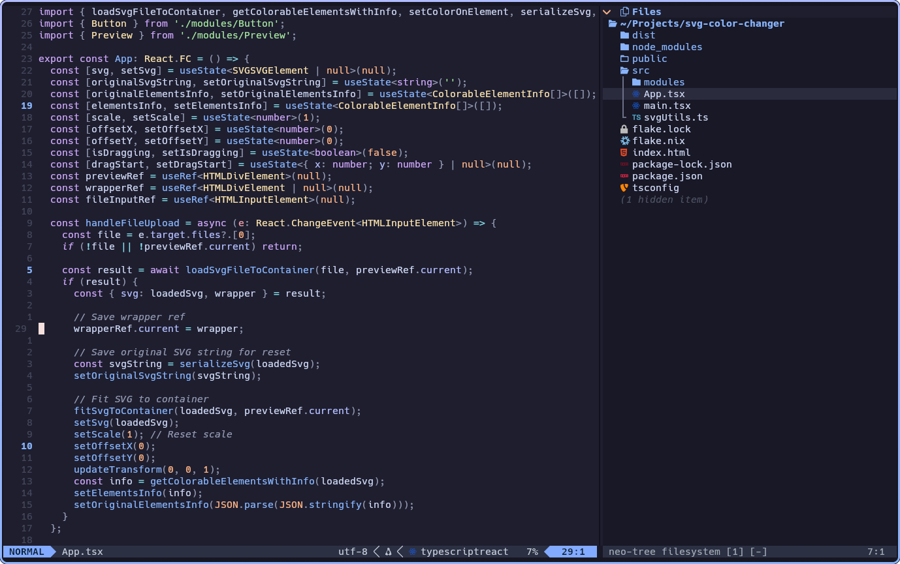

# hml.nvim

Minimal H / M / L viewport markers for Neovim.

`hml.nvim` places lightweight line markers for cursor jumps to the home (top), middle, and last (bottom) rows of the window.

- H (High): Jumps to the home (top) row of the window.
- M (Middle): Jumps to the middle row of the window.
- L (Low): Jumps to the last (bottom) row of the window.

This plugin **highlights the row number** for **each jump location**.

## Features

- ⌛️ Minimal and lightweight. No external dependencies
- ✏️ Native sign + numhl based rendering
- ⏱️ Real-time viewport tracking
- 🖌️ Colorscheme friendly
- ⚙️ Fully configurable highlights
- 🐱 Lazy.nvim compatible

## Preview


## lazy.nvim

```lua
{
    "ergodice/hml.nvim",

    opts = {},
}
```

---

# Configuration

All highlight definitions use native `vim.api.nvim_set_hl()` specs.

also, you can write your own custom highlights or link to existing ones like so:
```lua
{
    "ergodice/hml.nvim",

    opts = {
        highlights = {
            HmlNumH = {
                fr = "#ff0000",
                bold = true,
            },

            HmlNumM = {
                link = "ErrorMsg",
            },
        },
    },
}
```


## Default configuration

```lua
{
    highlights = {
        HmlNumH = {
            link = "Directory",
        },

        HmlNumM = {
            link = "Directory",
        },

        HmlNumL = {
            link = "Directory",
        },
    },

    signs = {
        HmlSignH = {
            text = "",
            texthl = "",
            numhl = "HmlNumH",
        },

        HmlSignM = {
            text = "",
            texthl = "",
            numhl = "HmlNumM",
        },

        HmlSignL = {
            text = "",
            texthl = "",
            numhl = "HmlNumL",
        },
    },
}
```
